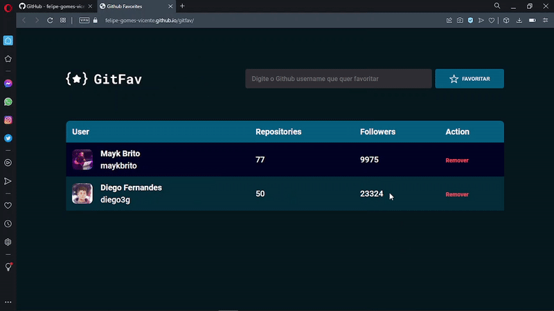

# Github Favorites

<h1 align="center">
    
</h1>

<br>

### 💻 Github Favorites

Building a GitFav page to consume APi from Github and manipulate data by saving, displaying in a table and deleting with HTML, Javascript and CSS, Object-oriented programming, events, classes, inheritance and polymorphism were applied.


What was developed:

- Lógica e Algoritmos com Javascript;
- Consumo de API pública do Github;
- LocalStorage para salvar os dados;
- Imutabilidade dos dados;
- Promessas com Async Await;
- Classes e eventos;
- Herança e Polimorfismo;
- Tratar erros com try, catch e throw
- Mapeamento de rotas;
- Assíncrono e promises;
- Orientação a objetos;
- Layout do Figma;
- Tipos de dados no javascipt;
- Manipular a DOM;
- Funções callbacks;
- Clean Code;
- ES6 Modules;
- Injeção de dependências;
- Estruturando HTML com tags semânticas;
- Unidade de medida flexível;
- Importar arquivo de CSS externo no projeto;
- Aplicando fontes(tipografia) customizadas no arquivo do CSS e iniciar o CSS externo;
- Trabalhando com cores e fontes;
- Acessibilidade sr-only;
- Alinhando e posicionando textos e elementos;
- Aplicando os espaçamentos;
- Bordas e classificações de elementos;
- Transições em CSS;
- Utilizar variaveis CSS para manipular a paleta de cores do projeto e tamanho da fonte;
- Reset CSS removendo possíveis inconsistências entre navegadores diferentes;
- Estrutura de sistema de arquivos do projeto separado por pasta;


I applied my knowledge of the Explorer from Rocketseat concepts in a practical way 
to this project, with the lessons:

- Getting to know new concepts of HTML and CSS;
- Advancing HTML and CSS;
- Introduction to Programming, Logic and Algorithms with Javascript;
- Advancing Programming WEB with Javacript;
- Javascript before the Framework;
- Advancing in Promises;
  
<br />

- [EXPLORER - Rocketseat](https://www.rocketseat.com.br/explorer)
- [Figma do Desafio - GitFav](https://www.figma.com/file/B5PCSL3rEAoYJro6QFKYtp/%5BDesafios-Explorer%5D-GitFav-(Copy)-(Copy))


## 🚀 Getting started

Clone Project and access folder and start the server it is necessary to have nodeJs
installed and Visual Studio Code.

### Programs needed to Getting started

- [NodeJS](https://nodejs.org/en/)
- [Live Server (Opcional)](https://marketplace.visualstudio.com/items?itemName=ritwickdey.LiveServer)
- [Visual Studio Code - Vscode](https://code.visualstudio.com/)

Clone the project and access the folder

```bash
$ git clone https://github.com/DenerBarros/gitfav-app.git
$ cd gitfav-app
```

With nodeJs installed start server

```bash
 $ npm install
 $ npm start
```